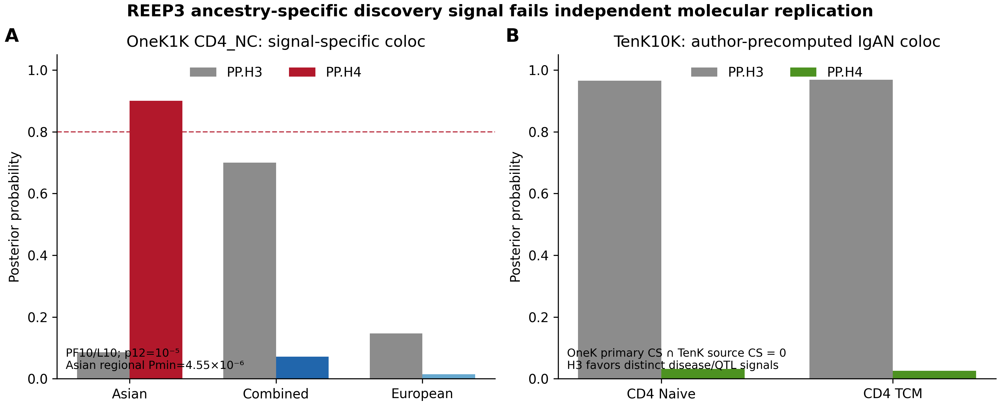
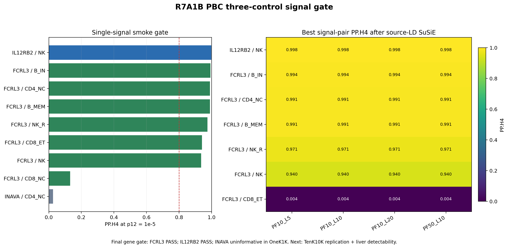

# Open regulatory evidence: completion-first immune-disease signal gates

This repository contains the reproducible, open-data workflow used to test whether immune-disease GWAS signals share cell-specific cis-eQTL signals in OneK1K and TenK10K. It retains the completed IgAN work and the current primary biliary cholangitis (PBC) candidate gate.

The repository is evidence-first: frozen candidate universes, all tested comparisons, negative and ambiguous results, software cross-checks, and gate decisions are retained together. Raw third-party datasets and donor-level genotype/LD matrices are not mirrored here; exact URLs, sizes, hashes, and expected local locations are recorded in [`data/LARGE_DATA_MANIFEST.tsv`](data/LARGE_DATA_MANIFEST.tsv).

## Current evidence state

- `ZMIZ1 × NK` is the positive benchmark: OneK1K combined-IgAN PP.H4 ≈ 0.931 and TenK10K NK precomputed PP.H4 ≈ 0.998.
- The frozen R6A2B0 expansion tested 183 cell–gene combinations across 8 additional loci and 3 ancestry datasets (549 comparisons).
- No additional combined-IgAN locus passed the robust shared-signal gate.
- Three combined smoke ambiguities received source-matched LD and 12 SuSiE-RSS sensitivity fits; all fits converged, but no stable 95% credible set was formed.
- `Asian-only IgAN × REEP3 × CD4_NC` passed the targeted OneK1K signal gate (PF10/L10 PP.H4 ≈ 0.900; one 15-variant credible set stable across four LD/L settings).
- REEP3 failed the frozen TenK10K replication gate: the OneK primary credible set had zero exact overlap with the TenK source credible sets after unique GRCh37→GRCh38 mapping, while author-precomputed IgAN coloc was H3-dominant in CD4 Naive and CD4 TCM (PP.H4 ≈ 0.031 and 0.026).

The frozen IgAN decision is `IMMUNE_CISEQTL_FULL24 = FROZEN_NO_GO`. REEP3 remains a discovery-only result and is not counted as a replicated locus.

R6A3A1 has now completed the public pQTL and kidney gate on real bytes. Of 11 pre-frozen plasma-protein targets, only TNFSF8 and TNFSF12 were source-supported. Their three valid source SuSiE components all failed the shared-signal gate (maximum PP.H4 among valid components ≈ 0.018). GSE127136 donor-level kidney pseudobulk showed a nonsignificant case-lower ZMIZ1 shift (13 IgAN vs 6 paracancer controls; difference = -0.256 log2CPM; exact permutation P = 0.483).

The final state is `IGAN_REGULATORY_MAIN = FROZEN_ARCHIVE`. The next protocol is R7A0, an open-data completion-first portfolio preflight across celiac disease, primary biliary cholangitis and alopecia areata.

R7A1A has now completed the true-byte portfolio gate. PBC `GCST90061440` passed its 5,054,572-row schema audit and exposes 56 matched locus summary-statistics/LD pairs in the GJOKA archive. All three frozen PBC controls are cross-resource testable; IL12RB2 and FCRL3 are source-positive in both OneK1K and TenK10K, while INAVA/C1orf106 is weak in OneK1K. CeD was held because only UBASH3A was source-positive in both resources, its 2020 Immunochip file lacks SE, and the larger `GCST90014442` source is UK Biobank-derived and therefore excluded by the frozen data rule.

R7A1B has now executed that bounded PBC gate on real bytes. Nine frozen OneK cell–gene tests produced seven trigger combinations. Source-matched disease and QTL LD, four PF/L sensitivity configurations and 28 converged SuSiE fits support signal-specific shared genes at `FCRL3` and `IL12RB2`; `INAVA` remains uninformative because its OneK QTL is weak. `FCRL3 × CD8_ET` illustrates the required multi-signal correction: single-signal PP.H4 ≈ 0.941 fell to ≈ 0.004 after source-LD decomposition.

R7A1C1A has now closed the compatible-cell TenK10K replication gate for both eligible genes. IL12RB2 × NK retains robust H4 on 396 full PBC/TenK allele-matched variants (default PP.H4 ≈ 0.998). FCRL3 × B intermediate now has 343 exact variants, default PP.H4 ≈ 0.992 and low-prior H4/(H3+H4) ≈ 0.922; the four leading shared-weight variants are exactly TenK source CS1. The original HRA runner was invalidated because `CB` is not a called-cell flag. The outcome-blind v2 runner uses `xf` bit 8 molecule representatives, reconstructed called cells and stricter per-donor target thresholds.

The current state is `NEW_PRIMARY_PROJECT = HOLD_PENDING_FIVE_DONOR_HRA_V2`. The only authorized next stage is the five-PBC-donor HRA008003 byte execution. Large third-party inputs are not mirrored; exact HRA URLs, bytes and provider MD5 values are recorded in [`data/R7A1C1A_LARGE_ASSET_MANIFEST.tsv`](data/R7A1C1A_LARGE_ASSET_MANIFEST.tsv).





## Repository layout

```text
analysis/r6a2b0/   frozen Python, R and PowerShell workflow
analysis/r6a2c/    REEP3 OneK source-LD and signal-specific falsification
analysis/r6a2d/    targeted TenK summary/coloc intake and cross-build adjudication
analysis/r6a3a/    public Sun 2018 pQTL and GSE127136 kidney gate
analysis/r7a1a/    PBC/CeD byte intake, source audit and frozen-control screen
analysis/r7a1b/    bounded PBC ABF, source-LD, SuSiE and signal adjudication
analysis/r7a1c1/   TenK full-window replication and hardened HRA donor gate
data/              large-file manifest and data availability rules
environment/       Python and R package requirements
figures/           decision figures
protocols/         frozen analysis and next-stage protocols
reports/           detailed Chinese-language audit records
results/r6a2a1/    positive benchmark tables
results/r6a2b0/    549-test and targeted multi-signal outputs
results/r6a2c/     REEP3 OneK signal-level outputs and gates
results/r6a2d/     TenK replication, liftover overlap and final adjudication
results/r6a3a1/    pQTL source-component, kidney and final freeze outputs
results/r7a1a/     PBC/CeD schema, GJOKA inventory, QTL controls and gate state
results/r7a1b/     PBC smoke, source-LD QC, credible sets and final adjudication
results/r7a1c/     TenK replication, source-CS tables and outcome-blind QA
```

## Reproduction

1. Install Python 3.11+ and R 4.4+; install the packages listed under `environment/`.
2. Download the files listed in `data/LARGE_DATA_MANIFEST.tsv` and place them at the specified relative paths.
3. Set `IGAN_PROJECT_ROOT` to the project root.
4. Run the bounded workflow from the project root:

```powershell
$env:IGAN_PROJECT_ROOT = (Get-Location).Path
pwsh -File .\analysis\r6a2b0\RUN_R6A2B0_8LOCUS_BOUNDED_EXPANSION.ps1
```

The runner intentionally stops after smoke-test adjudication. Build LD only for combinations listed in `results/r6a2b0/R6A2B0_sourceLD_triggers.tsv`, then run scripts 08–10. This preserves the trigger-only rule.

The REEP3 follow-up can be reproduced after the large inputs are present:

```powershell
$env:IGAN_PROJECT_ROOT = (Get-Location).Path
pwsh -File .\analysis\r6a2c\RUN_R6A2C_REEP3_FALSIFICATION.ps1
python .\analysis\r6a2d\01_extract_tenk_reep3_summary.py
python .\analysis\r6a2d\02_extract_tenk_igan_cd4_coloc_members.py
python .\analysis\r6a2d\03_compare_onek_tenk_reep3_signals.py
```

The final pQTL/kidney gate can be reproduced after the R6A3A inputs in the large-data manifest are present:

```powershell
$env:IGAN_PROJECT_ROOT = (Get-Location).Path
pwsh -File .\analysis\r6a3a\RUN_R6A3A_COMPLETION_DESIGN_GATE.ps1
```

The R7A1A portfolio intake is self-contained apart from the OneK1K/TenK10K files listed in the manifest. It intentionally stops before disease–QTL colocalization:

```powershell
$env:R7_PROJECT_ROOT = (Get-Location).Path
pwsh -File .\analysis\r7a1a\RUN_R7A1A_TRUE_BYTE_QTL_PREFLIGHT.ps1
```

The R7A1B runner reads the full OneK1K archive, but downloads only the triggered GJOKA locus members and builds LD only for triggered cell–gene combinations:

```powershell
$env:R7_PROJECT_ROOT = (Get-Location).Path
pwsh -File .\analysis\r7a1b\RUN_R7A1B_PBC_3CONTROL_SIGNAL_GATE.ps1
```

The R7A1C1 HRA runner processes one official PBC liver BAM at a time and deletes it only after validated compact output. It is resumable:

```powershell
$env:R7_PROJECT_ROOT = (Get-Location).Path
pwsh -File .\analysis\r7a1c1\RUN_R7A1C1_HRA008003_TARGET_PANEL_v2.ps1
```

## Evidence and licensing

Code is released under the MIT License. Reports and small derived summary tables are provided for transparency. Third-party data remain subject to their source licenses and citation requirements; see [`DATA_AVAILABILITY.md`](DATA_AVAILABILITY.md).
