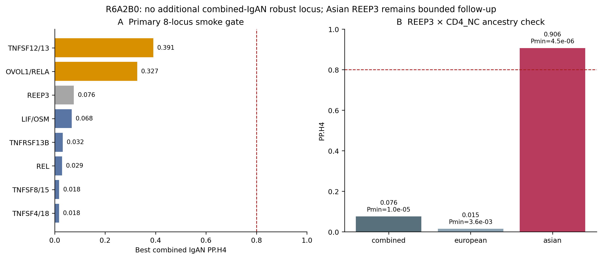

# IgAN open regulatory evidence

This repository contains the reproducible, open-data workflow used to test whether IgA nephropathy (IgAN) GWAS signals share cell-specific cis-eQTL signals in OneK1K and TenK10K.

The repository is evidence-first: frozen candidate universes, all tested comparisons, negative and ambiguous results, software cross-checks, and gate decisions are retained together. Raw third-party datasets and donor-level genotype/LD matrices are not mirrored here; exact URLs, sizes, hashes, and expected local locations are recorded in [`data/LARGE_DATA_MANIFEST.tsv`](data/LARGE_DATA_MANIFEST.tsv).

## Current evidence state

- `ZMIZ1 × NK` is the positive benchmark: OneK1K combined-IgAN PP.H4 ≈ 0.931 and TenK10K NK precomputed PP.H4 ≈ 0.998.
- The frozen R6A2B0 expansion tested 183 cell–gene combinations across 8 additional loci and 3 ancestry datasets (549 comparisons).
- No additional combined-IgAN locus passed the robust shared-signal gate.
- Three combined smoke ambiguities received source-matched LD and 12 SuSiE-RSS sensitivity fits; all fits converged, but no stable 95% credible set was formed.
- `Asian-only IgAN × REEP3 × CD4_NC` is the only bounded follow-up candidate (smoke PP.H4 ≈ 0.906). It is not counted as a primary positive because the combined and European datasets do not support it and the Asian regional disease signal is sub-genome-wide significant.

The frozen decision is `FULL24_EXPANSION = HOLD`. The next protocol is a single-combination REEP3 ancestry-specific falsification gate.



## Repository layout

```text
analysis/r6a2b0/   frozen Python, R and PowerShell workflow
data/              large-file manifest and data availability rules
environment/       Python and R package requirements
figures/           decision figures
protocols/         frozen analysis and next-stage protocols
reports/           detailed Chinese-language audit records
results/r6a2a1/    positive benchmark tables
results/r6a2b0/    549-test and targeted multi-signal outputs
```

## Reproduction

1. Install Python 3.11+ and R 4.4+; install the packages listed under `environment/`.
2. Download the files listed in `data/LARGE_DATA_MANIFEST.tsv` and place them at the specified relative paths.
3. Set `IGAN_PROJECT_ROOT` to the project root.
4. Run the bounded workflow from the project root:

```powershell
$env:IGAN_PROJECT_ROOT = (Get-Location).Path
pwsh -File .\analysis\r6a2b0\RUN_R6A2B0_8LOCUS_BOUNDED_EXPANSION.ps1
```

The runner intentionally stops after smoke-test adjudication. Build LD only for combinations listed in `results/r6a2b0/R6A2B0_sourceLD_triggers.tsv`, then run scripts 08–10. This preserves the trigger-only rule.

## Evidence and licensing

Code is released under the MIT License. Reports and small derived summary tables are provided for transparency. Third-party data remain subject to their source licenses and citation requirements; see [`DATA_AVAILABILITY.md`](DATA_AVAILABILITY.md).

