# Open regulatory evidence: completion-first immune-disease signal gates

This repository contains the reproducible, open-data workflow used to test whether immune-disease GWAS signals share cell-specific cis-eQTL signals in OneK1K and TenK10K. It retains the completed IgAN work and the current primary biliary cholangitis (PBC) manuscript evidence chain.

The repository is evidence-first: frozen candidate universes, all tested comparisons, negative and ambiguous results, software cross-checks, and gate decisions are retained together. Raw third-party datasets and donor-level genotype/LD matrices are not mirrored here; exact URLs, sizes, hashes, and expected local locations are recorded in [`data/LARGE_DATA_MANIFEST.tsv`](data/LARGE_DATA_MANIFEST.tsv).

## Current evidence state

- `ZMIZ1 × NK` is the positive benchmark: OneK1K combined-IgAN PP.H4 ≈ 0.931 and TenK10K NK precomputed PP.H4 ≈ 0.998.
- The frozen R6A2B0 expansion tested 183 cell–gene combinations across 8 additional loci and 3 ancestry datasets (549 comparisons).
- No additional combined-IgAN locus passed the robust shared-signal gate.
- Three combined smoke ambiguities received source-matched LD and 12 SuSiE-RSS sensitivity fits; all fits converged, but no stable 95% credible set was formed.
- `Asian-only IgAN × REEP3 × CD4_NC` passed the targeted OneK1K signal gate (PF10/L10 PP.H4 ≈ 0.900; one 15-variant credible set stable across four LD/L settings).
- REEP3 failed the frozen TenK10K replication gate: the OneK primary credible set had zero exact overlap with the TenK source credible sets after unique GRCh37→GRCh38 mapping, while author-precomputed IgAN coloc was H3-dominant in CD4 Naive and CD4 TCM (PP.H4 ≈ 0.031 and 0.026).

The frozen IgAN decision is `IMMUNE_CISEQTL_FULL24 = FROZEN_NO_GO`. REEP3 remains a discovery-only result and is not counted as a replicated locus.

R6A3A1 has now completed the public pQTL and kidney gate on real bytes. Of 11 pre-frozen plasma-protein targets, only TNFSF8 and TNFSF12 were source-supported. Their three valid source SuSiE components all failed the shared-signal gate (maximum PP.H4 among valid components ≈ 0.018). GSE127136 donor-level kidney pseudobulk showed a nonsignificant case-lower ZMIZ1 shift (13 IgAN vs 6 paracancer controls; difference = -0.256 log2CPM; exact permutation P = 0.483).

The final state is `IGAN_REGULATORY_MAIN = FROZEN_ARCHIVE`. The next protocol is R7A0, an open-data completion-first portfolio preflight across celiac disease, primary biliary cholangitis and alopecia areata.

R7A1A has now completed the true-byte portfolio gate. PBC `GCST90061440` passed its 5,054,572-row schema audit and exposes 56 matched locus summary-statistics/LD pairs in the GJOKA archive. All three frozen PBC controls are cross-resource testable; IL12RB2 and FCRL3 are source-positive in both OneK1K and TenK10K, while INAVA/C1orf106 is weak in OneK1K. CeD was held because only UBASH3A was source-positive in both resources, its 2020 Immunochip file lacks SE, and the larger `GCST90014442` source is UK Biobank-derived and therefore excluded by the frozen data rule.

R7A1B has now executed that bounded PBC gate on real bytes. Nine frozen OneK cell–gene tests produced seven trigger combinations. Source-matched disease and QTL LD, four PF/L sensitivity configurations and 28 converged SuSiE fits support signal-specific shared genes at `FCRL3` and `IL12RB2`; `INAVA` remains uninformative because its OneK QTL is weak. `FCRL3 × CD8_ET` illustrates the required multi-signal correction: single-signal PP.H4 ≈ 0.941 fell to ≈ 0.004 after source-LD decomposition.

R7A1C1A has now closed the compatible-cell TenK10K replication gate for both eligible genes. IL12RB2 × NK retains robust H4 on 396 full PBC/TenK allele-matched variants (default PP.H4 ≈ 0.998). FCRL3 × B intermediate now has 343 exact variants, default PP.H4 ≈ 0.992 and low-prior H4/(H3+H4) ≈ 0.922; the four leading shared-weight variants are exactly TenK source CS1.

R7A1C1B0R then completed a hostile pre-execution audit of the five-donor tissue gate. The received v3 runner had a malformed final-adjudicator assignment, accepted an orphan compact summary without a matching byte-verification receipt, and could falsely reject coordinate-sorted BAMs after a fixed 500,000-record prefix. The corrected v3.1 runner uses `xf` bit 8 molecule representatives, reconstructed called cells, an adaptive 0.5–5 million-record schema check and exact summary/receipt identity. Its manifest, parser and runtime preflight pass. Testing the public supplementary workbooks found pooled human FCRL3 B-cell marker evidence but no donor-by-lineage-by-target matrix; their only IL12RB2 hit is from a mouse sheet, so they cannot replace the human BAM gate.

R7A1C1B1R recorded the first real execution checkpoint and fixed a coordinate-sorted-prefix false failure without changing the full-scan biological thresholds.

R7A1C1B2 has now completed the exact five-donor PBC liver adjudication. All five donors pass technical QC; FCRL3 in the frozen B-cell gate and IL12RB2 in the frozen NK-cell gate are promotion-eligible in 5/5 donors. The five scans cover 2,024,279,500 alignment records, 284,941,671 molecule-representative records and 23,809 called cells. The official adjudication and a separately generated adjudication are byte-for-byte equivalent at the parsed JSON level; eight independent closeout checks pass. Each BAM was deleted only after its compact summary and byte-verification receipt were validated.

PBC is therefore promoted to the primary manuscript-scale project. The current claim is deliberately bounded to replicated disease–eQTL sharing plus target detectability in prespecified PBC liver immune lineages; it does not claim PBC-versus-control differential expression or tissue mediation.

R7A2A0 has frozen the next executable gate. Official HRA008003 metadata identify HRR1849454–58 as five hepatic-hemangioma non-lesion liver controls (134,657,112,757 bytes total). Their byte/MD5 manifest, resumable runner, exact 5-vs-5 donor-level comparison and synthetic regression tests are included. The next stage is `R7A2A1_HRA008003_EXACT_5_VS_5_CONTROL_TARGET_PANEL`.

R7A2A1 has now completed that exact 5-vs-5 gate. All five control BAM identities, schemas, compact summaries and deletion receipts pass; an independent closeout audit passes 19/19 checks and reproduces the frozen JSON and TSV exactly. Both target-lineage pairs were detected in 5/5 PBC and 5/5 control donors. FCRL3-B was directionally lower in PBC (mean log1p CPM difference -0.786; exact P=0.111), while IL12RB2-NK was directionally higher (+0.330; exact P=0.0635); both have BH q=0.111. The tissue layer therefore supports bounded lineage localization but not PBC-specific upregulation.

PBC remains the primary project because the core disease-eQTL signal-sharing evidence and 2/2 TenK10K replication remain intact. The next stage is `R7A2A2_MANUSCRIPT_EVIDENCE_FREEZE_AND_FIGURE_ASSEMBLY`. Full ten-donor reclustering is deferred because it would not increase the donor count and is not required for the bounded core claim.

R7A2A2 subsequently froze the claim–evidence matrix, novelty boundary, manuscript skeleton, Figure 1–6 source manifest and supplementary-item plan. R7A2A3 has now converted that evidence into a complete English scientific draft using the QiTeng v0.3.24.2 guarded manuscript workflow. The draft contains all Methods and Results modules, retains FCRL3/CD8_ET and INAVA boundary-changing negatives, and keeps the 5-vs-5 tissue result in the main evidence hierarchy. Deterministic manuscript QA passes 22/22 checks, including numerical tokens reconstructed from upstream tables, reference continuity and first-appearance order, required boundary sentences, and an 11/11 Methods–Results mirror.

R7A2A4 subsequently completed the hostile manuscript audit, including claim/source repair, 34/34 numeric checks, 17/17 reader-facing checks and repaired Figure 1–4/6 semantics. R7A2A5 has now selected **Human Genomics / Research** as the primary submission route and assembled the journal-format manuscript, graphical abstract, six main figures, four supplementary figures and a ten-table supplementary workbook. Final machine QA passes 55 checks with no technical failures. The submission state is `AWAITING_AUTHOR_METADATA`: author order, affiliations, correspondence, CRediT, funding, competing interests, local ethics/waiver wording and all-author approval must be supplied by the authors before submission. No new biological analysis is required by default.

The R7A submission route is now archived while the project follows the R7B0 v2 major redesign. R7B0A recovered a fully auditable current-release OneK model even though the historical PF10 input bytes remain unresolved: 14/14 PF10/PF50 model-identity rows and 28/28 SuSiE fits passed. R7B1A then froze a result-blind PBC-wide universe of 6,923 locus–gene–cell comparisons and regenerated current PF10 QTL statistics from public pseudobulk, donor genotype and covariates. Of 5,460 comparisons with at least 200 variants, the single-causal screen produced 112 default robust-H4 triggers and 72 prespecified H3/H4 ambiguities; 455 favored distinct signals, 4,821 did not trigger, and 1,463 lacked sufficient variant overlap. Independent QA passes 12/12 checks.

The original 184 screen triggers remain a nested primary verification cohort. R7B1B v2 expands the pre-result-frozen multi-signal workload to 642 high-information comparisons so H4-to-H3 and H3-to-H4 reclassification can be measured symmetrically.

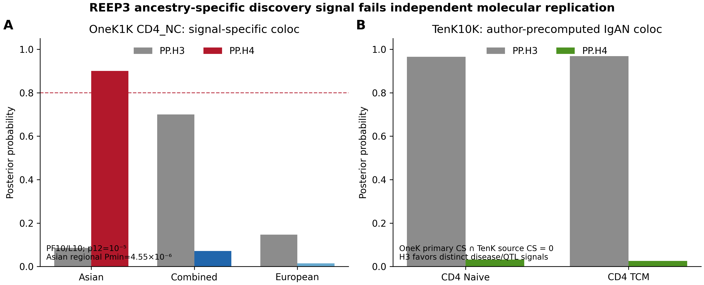

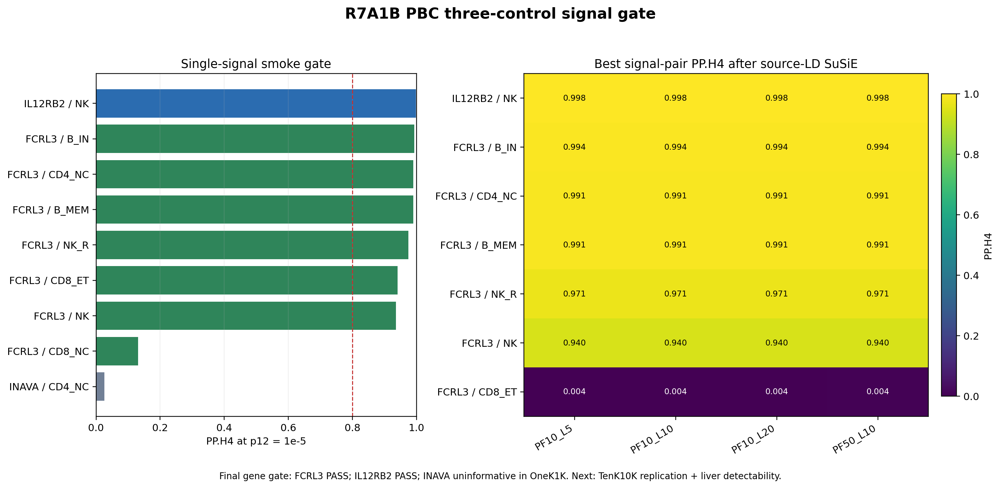

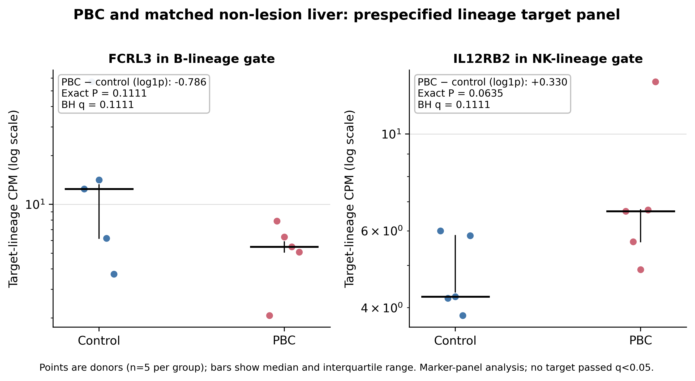


## R7B1B v2 high-information multi-signal reclassification

R7B1B v2 preserves the original 184 screen-positive/ambiguous comparisons as the primary verification cohort and adds a pre-result-frozen symmetric layer of 455 H3 comparisons plus three borderline high-information calibration cases. All 642 comparisons were run with GJOKA study-matched disease LD and current-release OneK1K PF10/PF50 cell-specific LD; 2,568 SuSiE fits completed with no QC failures.

The PF10 adjudication retained 78 stable H4 and 409 stable H3 comparisons. Eight ABF H3 comparisons were reclassified to stable H4, while four ABF H4 comparisons were reclassified to stable H3. FCRL3 × CD8_ET reproduces the key H4-to-H3 counterexample; IL12RB2 × NK and the FCRL3 B-cell comparisons remain stable shared-signal exemplars. Independent mechanical QA passes 19/19 checks.

The evidence ceiling is **PBC-wide ABF screening followed by source-matched multi-signal reclassification of the prespecified high-information H3/H4 subset**. It is not a multi-signal analysis of every one of the 6,923 screened comparisons. The next frozen stage is simulation/calibration under known truth; manuscript rewriting remains on hold.

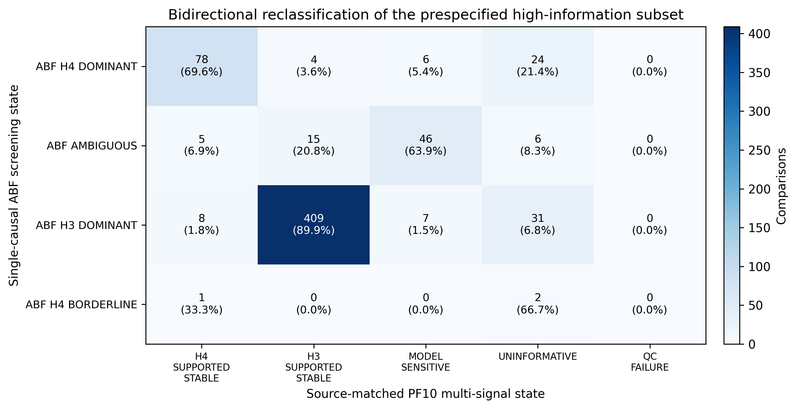

## Repository layout

```text
analysis/r6a2b0/   frozen Python, R and PowerShell workflow
analysis/r6a2c/    REEP3 OneK source-LD and signal-specific falsification
analysis/r6a2d/    targeted TenK summary/coloc intake and cross-build adjudication
analysis/r6a3a/    public Sun 2018 pQTL and GSE127136 kidney gate
analysis/r7a1a/    PBC/CeD byte intake, source audit and frozen-control screen
analysis/r7a1b/    bounded PBC ABF, source-LD, SuSiE and signal adjudication
analysis/r7a1c1/   TenK full-window replication and hardened HRA donor gate
analysis/r7a2/     frozen five-control HRA runner and exact donor comparison
analysis/r7a2a3/   deterministic manuscript structure, reference and numeric QA
analysis/r7a2a5/   Human Genomics asset builders, WPS export and final QA
analysis/r7b2/     RP v3 manuscript, Figure 1-6, WPS export and manuscript QA
analysis/r7b3a/    source-bound Figure 1-6, S1-S10, DOCX and release QA builders
analysis/r7b1/     PBC-wide eligibility, harmonization and PF10 ABF screen
analysis/r7b1b_v2/ R7B1B v2 source-LD, SuSiE, adjudication, QA and release
data/              large-file manifest and data availability rules
environment/       Python and R package requirements
figures/           decision figures
figures/r7a2a3_draft/ R7A2A2-frozen Figure 1–4/6 review assets with known repair notes
figures/r7a2a5_submission/ Human Genomics main, supplementary and graphical-abstract assets
manuscript/r7a2a5/ Human Genomics-formatted manuscript v3 in MD, DOCX and WPS PDF
manuscript/r7b2/  RP v3 complete English manuscript v1 in MD, DOCX and WPS PDF
manuscript/r7b3a/ source-corrected manuscript v2 in MD, DOCX and WPS PDF
protocols/         frozen analysis and next-stage protocols
reports/           detailed Chinese-language audit records
results/r6a2a1/    positive benchmark tables
results/r6a2b0/    549-test and targeted multi-signal outputs
results/r6a2c/     REEP3 OneK signal-level outputs and gates
results/r6a2d/     TenK replication, liftover overlap and final adjudication
results/r6a3a1/    pQTL source-component, kidney and final freeze outputs
results/r7a1a/     PBC/CeD schema, GJOKA inventory, QTL controls and gate state
results/r7a1b/     PBC smoke, source-LD QC, credible sets and final adjudication
results/r7a1c/     TenK replication, source-CS tables and outcome-blind QA
results/r7a1c1b0r/ five-donor runner QA, BAM-prefix schema test and supplement audit
results/r7a1c1b1r/ real three-donor checkpoint, donor-4 schema hotfix and v3.2 QA
results/r7a1c1b2/  completed five-PBC-donor summaries, receipts and final adjudication
results/r7a2a0/    control-source audit, manifest preflight and execution-pack tests
results/r7a2a1/    exact 5-vs-5 donor metrics, independent QA and final adjudication
results/r7a2a3/    claim/reference/risk ledgers, Methods–Results mirror and manuscript QA
results/r7a2a5/    journal matrix, supplementary workbook, state and 55-check final QA
results/r7b1a/     6,923-test ABF registry, exact 184-trigger set and independent QA
results/r7b1b_v2/  642-comparison bidirectional reclassification and 19-check QA
results/r7b2/       manuscript QA, state and artifact identity
results/r7b3a/      S1-S10 public supplements, 36-check QA and release state
```

## Reproduction

1. Install Python 3.11+ and R 4.4+; install the packages listed under `environment/`.
2. Download the files listed in `data/LARGE_DATA_MANIFEST.tsv` and place them at the specified relative paths.
3. Set `IGAN_PROJECT_ROOT` to the project root.
4. Run the bounded workflow from the project root:

```powershell
$env:IGAN_PROJECT_ROOT = (Get-Location).Path
pwsh -File .\analysis\r6a2b0\RUN_R6A2B0_8LOCUS_BOUNDED_EXPANSION.ps1
```

The runner intentionally stops after smoke-test adjudication. Build LD only for combinations listed in `results/r6a2b0/R6A2B0_sourceLD_triggers.tsv`, then run scripts 08–10. This preserves the trigger-only rule.

The REEP3 follow-up can be reproduced after the large inputs are present:

```powershell
$env:IGAN_PROJECT_ROOT = (Get-Location).Path
pwsh -File .\analysis\r6a2c\RUN_R6A2C_REEP3_FALSIFICATION.ps1
python .\analysis\r6a2d\01_extract_tenk_reep3_summary.py
python .\analysis\r6a2d\02_extract_tenk_igan_cd4_coloc_members.py
python .\analysis\r6a2d\03_compare_onek_tenk_reep3_signals.py
```

The final pQTL/kidney gate can be reproduced after the R6A3A inputs in the large-data manifest are present:

```powershell
$env:IGAN_PROJECT_ROOT = (Get-Location).Path
pwsh -File .\analysis\r6a3a\RUN_R6A3A_COMPLETION_DESIGN_GATE.ps1
```

The R7A1A portfolio intake is self-contained apart from the OneK1K/TenK10K files listed in the manifest. It intentionally stops before disease–QTL colocalization:

```powershell
$env:R7_PROJECT_ROOT = (Get-Location).Path
pwsh -File .\analysis\r7a1a\RUN_R7A1A_TRUE_BYTE_QTL_PREFLIGHT.ps1
```

The R7A1B runner reads the full OneK1K archive, but downloads only the triggered GJOKA locus members and builds LD only for triggered cell–gene combinations:

```powershell
$env:R7_PROJECT_ROOT = (Get-Location).Path
pwsh -File .\analysis\r7a1b\RUN_R7A1B_PBC_3CONTROL_SIGNAL_GATE.ps1
```

The corrected R7A1C1 HRA runner processes one official PBC liver BAM at a time and deletes it only after validated compact output plus an exact byte-verification receipt. It is resumable:

```powershell
$env:R7_PROJECT_ROOT = (Get-Location).Path
pwsh -File .\analysis\r7a1c1\RUN_R7A1C1_HRA008003_TARGET_PANEL_v3_2.ps1
```

The R7A2A1 runner applies the same frozen target-panel algorithm to the exact five HRA008003 non-lesion liver controls, then performs the prespecified 5-vs-5 donor comparison. It is also resumable and deletes each control BAM only after validated compact output:

```powershell
$env:R7_PROJECT_ROOT = (Get-Location).Path
pwsh -File .\analysis\r7a2\RUN_R7A2A1_HRA008003_CONTROL_TARGET_PANEL_HARDENED.ps1
```

The R7B1A runner rebuilds the result-blind PBC-wide universe, GWAS harmonization, current-release PF10 QTL statistics, all 6,923 ABF records and the independently checked exact trigger set:

```powershell
$env:R7_PROJECT_ROOT = (Get-Location).Path
pwsh -File .\analysis\r7b1\RUN_R7B1A_PBCWIDE_ABF.ps1
```

The subsequent intake runner range-fetches only the 50 GJOKA members required by the frozen 25-locus R7B1B workload:

```powershell
$env:R7_PROJECT_ROOT = (Get-Location).Path
pwsh -File .\analysis\r7b1\DOWNLOAD_R7B1B_GJOKA_TRIGGER_MEMBERS.ps1
```

## Evidence and licensing

Code is released under the MIT License. Reports and small derived summary tables are provided for transparency. Third-party data remain subject to their source licenses and citation requirements; see [`DATA_AVAILABILITY.md`](DATA_AVAILABILITY.md).

## R7B1C truth-known simulation calibration

R7B1C completes the frozen six-scenario, 486-row, 486,000-replicate simulation benchmark using two empirical 128-variant GJOKA/OneK LD templates. It compares single-causal ABF with source-matched SuSiE/coloc and a bounded same-locus PF10-to-PF50 QTL-LD mismatch. Source-matched multi-signal inference reduced false-H4 decisions in the frozen distinct-signal scenarios, but also reduced shared-signal recovery and left many complex low-power replicates uninformative. The two-template PF10-to-PF50 mismatch had little effect. These are bounded calibration trade-offs, not evidence of general method superiority.

The public repository includes code, protocols, aggregate results, figure source data, independent QA and a SHA-256 manifest for the local per-grid truth tables. The simulation calibrates inference under the frozen templates and fixed effects; it does not validate a biological mechanism or represent every ancestry and locus architecture.

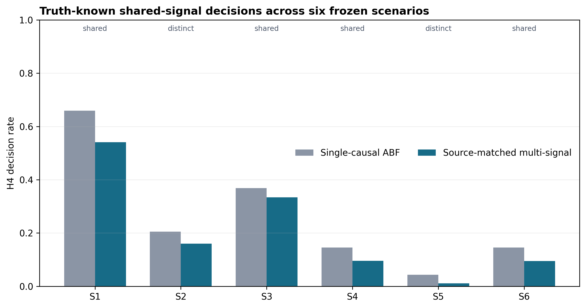

## R7B1D external multiome and direction gate

R7B1D retained four prespecified R7B1B anchors and queried current public FinnGen CASCADE bytes without reopening candidate selection. Three `CHIRBIL_PRIM–IL12RB2` records support PBC–eQTL sharing in `l1.NK`, `l2.NK` and `l1.PBMC` (PP.H4.abf 0.9698–0.9706; credible-set overlap 5–9 variants). The linked IL12RB2 peak is a positional chromatin layer; the eQTL anchor is not in the peak caQTL credible set, so a complete disease→caQTL→expression cascade is not claimed.

Current public FinnGen queries did not return a `CHIRBIL_PRIM–FCRL3` coloc pair. This is recorded as public-output non-return rather than a powered biological negative. FCRL3–B therefore retains OneK source-matched support and TenK cross-resource molecular-QTL replication only. Exact allele harmonization shows the PBC risk allele is associated with higher IL12RB2 expression across OneK, TenK and FinnGen contexts, and with lower FCRL3 expression in OneK and TenK B-cell contexts. These are directional associations, not mediation estimates.

The external gate is `PASS_BOUNDED`. R7B1C did not establish general method superiority; the next stage is a single integrated claim–evidence ledger and Figure 1–6 source-data freeze before manuscript rewriting.

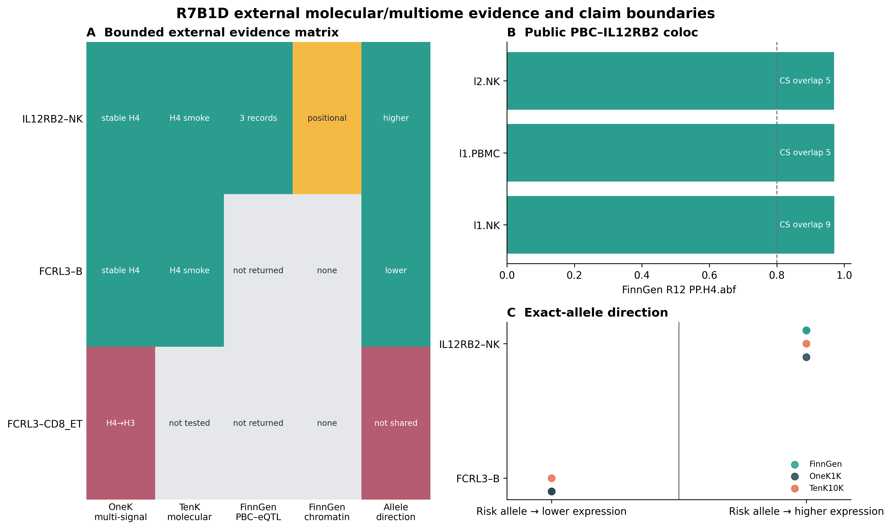

## R7B1E0 diagnostic closure and R7B1E evidence freeze

R7B1E0 repaired a post-result diagnostic interface defect without refitting SuSiE or coloc. The historical runner expected `kriging_rss()` to return a data frame, whereas `susieR 0.14.2` returns a list containing `conditional_dist`. Exact replay of the frozen z, LD, sample size, variant order and fitted `s_rss` completed 2,568/2,568 disease/QTL × PF10/PF50 diagnostic units across 642 comparisons and 47 loci. The official plotting rule (`logLR > 2` and `|z| > 2`) yielded one unique reviewed event, rs1800378; it entered no credible set and required no posterior refit. Historical classifications were preserved.

Signal-level semantic review confirmed the same pair identity for all 92 stable-H4 and all 428 stable-H3 comparisons across L10 and at least one other PF10 L setting. Thirty-two stable-H4 comparisons also contained an H3-qualifying pair, so shared and distinct pairs can coexist within a comparison. Stable H3 is therefore reported as support for a distinct pair, not global proof that no shared pair exists.

R7B1E freezes 22 claim–evidence records, nine hashed figure-source assets and a Figure 1–6 panel manifest. The evidence ceiling is **PBC-wide screening followed by source-matched multi-signal reclassification of the prespecified high-information H3/H4 subset, with scenario-dependent calibration and bounded external/tissue support**. General method superiority, a complete regulatory cascade and PBC-specific tissue enrichment are not established. Independent QA passes 21/21 checks for R7B1E0 and 21/21 for R7B1E. The next stage is R7B2 manuscript v1, with no reopening of locus, gene or cell selection.

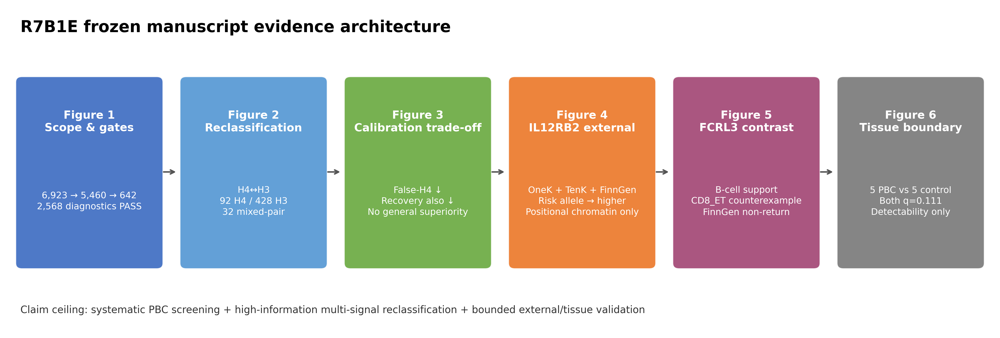

## R7B2A matched-input attribution and manuscript lock

R7B2A implements the RP v3 A0/A1/A2/M bridge on the exact frozen 642-comparison high-information subset. The historical ABF calculation is replayed on its original support (A0), then repeated on the actual multi-signal support (A1) and with GJOKA disease statistics (A2), before comparison with the frozen source-matched multi-signal result (M). Support restriction changed 15 categorical states and disease-statistic matching changed 19. Under matched inputs, 79 H4 and 413 H3 states remained stable, while 8 H4-to-H3 and 10 H3-to-H4 transitions persisted. These real-data transitions are descriptive and do not establish causal truth or general method superiority.

An iteration-level audit of all 486,000 R7B1C replicates found zero technical errors. Of 486,000 primary matched fits, 325,218 lacked a credible set in one or both traits, 160,782 formed an evaluable signal pair, and no fit had credible sets in both traits but no pair. Simulation performance is therefore reported both unconditionally and conditional on pair formation. The secondary mismatch branch did not store per-trait credible-set counts for zero-pair fits; its mechanistic interpretation remains restricted and no rerun was required.

R7B2A freezes a 27-record claim ledger, a 10-module Methods–Results mirror and an updated Figure 1–6 source manifest. Independent QA passes 53/53 checks. No disease, locus, gene or cell was added. The next stage is the complete English manuscript v1 within this evidence ceiling.

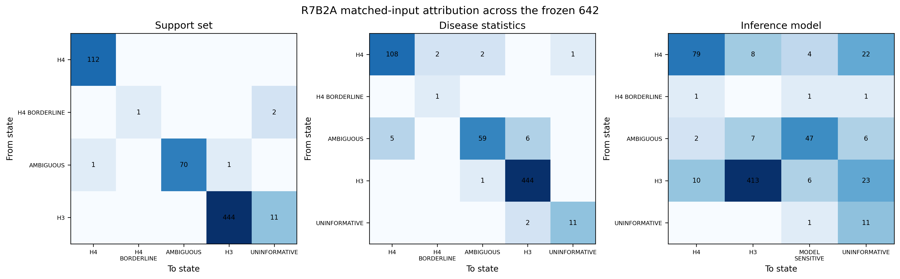

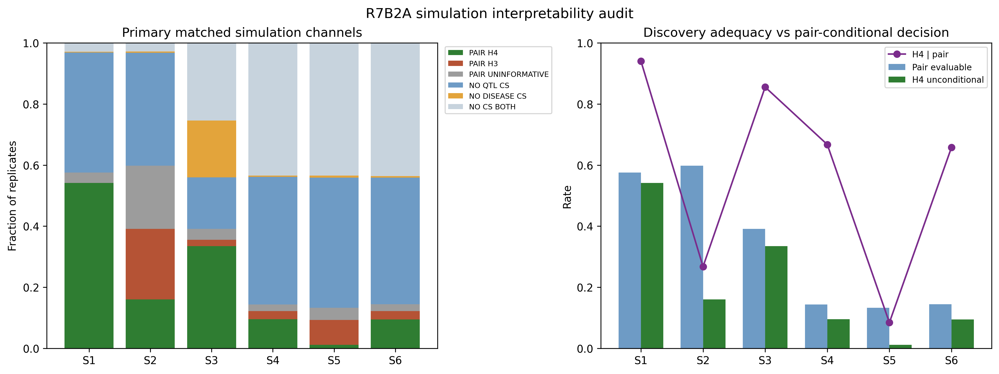

## R7B2 complete English manuscript v1

R7B2 converts the RP v3 evidence lock into a complete English research manuscript without reopening disease, locus, gene or cell selection. The 7,500-word author-review draft reports the 6,923-to-5,460-to-642 analysis scope, the A0/A1/A2/M matched-input attribution, signal-pair identity and coexistence, PF10/PF50 sensitivity, the discovery-versus-estimator simulation channels, bounded IL12RB2-NK and FCRL3 B-cell external support, and the exact 5-versus-5 liver tissue boundary.

The release includes six scripted publication figures in PNG/PDF/SVG, an editable DOCX, a 29-page PDF exported by WPS Writer, a 27-claim text-coverage audit and the detailed action record. Machine QA passes 17/17 checks. Author order, affiliations, correspondence, CRediT, funding, competing interests and local ethics/waiver wording remain explicit author-supplied fields; the package is therefore an author-review manuscript, not a submission-ready package.

The next frozen stage is `R7B3_HOSTILE_MANUSCRIPT_AUDIT`. It will audit statistical attribution, PBC/immune biological interpretation, novelty, figures, reproducibility and journal-facing claims. No new biological analysis is required by default.

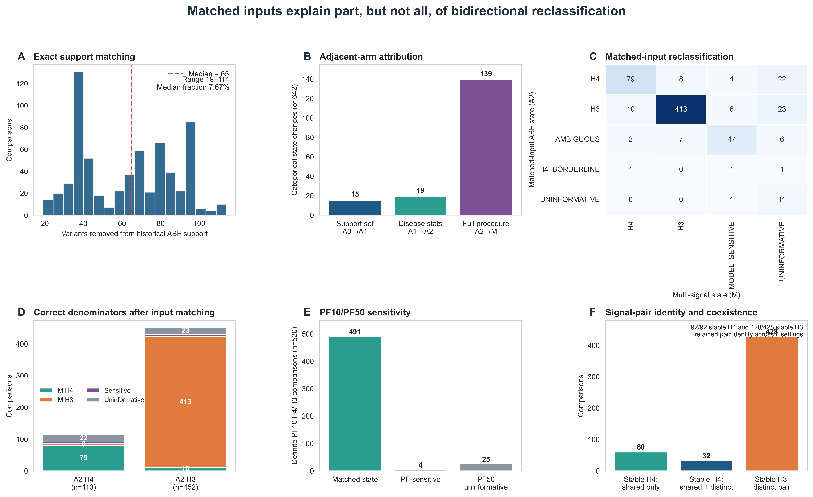

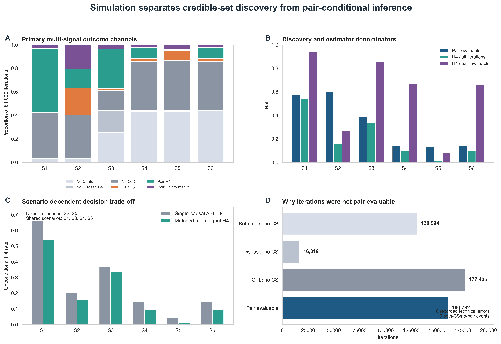

## R7B3A source-bound manuscript v2 and publication assets

R7B3 first audited the complete English manuscript against the frozen source tables and execution code. It corrected the Figure 5C A0/A1/A2/M values, restored the actual fixed simulation sample sizes and default-prior ABF admission rule, separated the 14 targeted comparison–model identity rows from the 14 cell labels, and removed causal-looking links from the bounded IL12RB2 chromatin panel.

R7B3A has now rebuilt all six composite figures from frozen inputs and assembled the actual S1–S10 supplementary files. The supplement contains the full 6,923-row screen registry, 642 matched-input trajectories, 2,568 fit-QC records, 10,542 signal-pair posteriors, the 486-row/486,000-iteration simulation summaries, external-evidence tables, the exact five-versus-five liver panel and the 27-record claim ledger. Individual-level genotype, BAM, pseudobulk matrices and licensed source archives remain excluded.

The source-corrected manuscript v2 is available as Markdown, editable DOCX and a 31-page PDF exported by WPS Writer. Six figures are released in PNG, PDF and SVG. Bibliographic verification passes 22/22 references, ten workbook sheets pass visual review, and final machine QA passes 36/36 checks. Author order, affiliations, correspondence, CRediT, funding, competing interests, ethics/waiver wording and all-author approval remain explicit human completion fields.

The next stage is `R7B4_TARGET_JOURNAL_AND_SUBMISSION_INTERFACE`: verify current official journal instructions, freeze the primary and backup submission routes, and assemble the journal-specific title/abstract, cover letter, checklist and upload map. No new biological analysis is required by default.

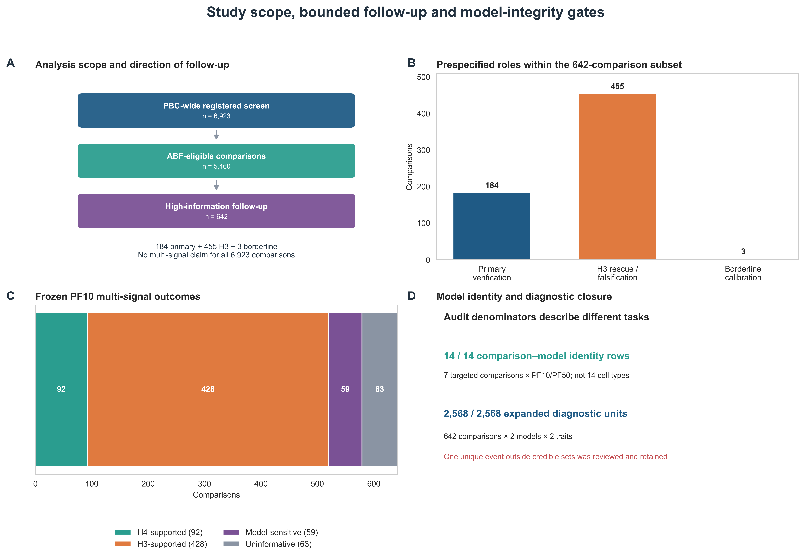

## R7B4A Human Genomics submission interface

R7B4A freezes **Human Genomics / Research** as the primary submission route after a current official-guideline audit. The scientific master remains unchanged: no disease, locus, gene, cell, threshold or numerical result was reopened. The journal-specific version uses a 270-word `Background / Results / Conclusions` abstract, eight keywords, complete declaration headings, supervised-LLM disclosure and the mandatory 920×300 graphical abstract.

The Figure 2F reader-facing label was corrected from an ambiguous “shared only” description to “no qualifying H3 pair”; the frozen 60/32 counts and source data did not change. The release includes six figures in PNG/PDF/SVG, an editable manuscript, a 31-page WPS review PDF, a one-page WPS cover-letter draft, the S1–S10 workbook and a CRC-validated machine-readable supplementary ZIP. Final machine QA passes 42/42 checks.

Author order, affiliations, correspondence, CRediT, funding, competing interests, institutional ethics/waiver wording, acknowledgements, APC/licence route and all-author approval remain a human completion gate. The package is a technically complete submission interface, not evidence that the manuscript has been submitted. The next frozen stage is `R7B4B_AUTHOR_COMPLETION_AND_FINAL_SUBMISSION_QA`.

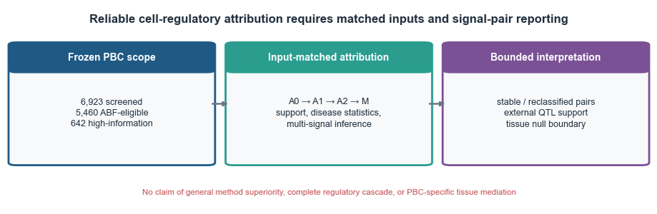

## R7B4B0 pre-author final-submission gate

R7B4B0 independently reverified the R7B4A release before any author information was injected. The 18,289,096-byte archive matches its frozen SHA-256, passes ZIP CRC and passes 55/55 internal checksums across 56 members. The public `main` identity and the peeled commit of the annotated R7B4A tag also pass. The 22 references are continuous and first appear in numerical order.

The historical R7B4A 42/42 QA remains an author-review gate. R7B4B0 adds a separate fail-closed `FINAL_SUBMISSION` mode: explicit author/declaration placeholders must be absent, the internal author-completion page must be removed, WPS outputs must be bound to exact DOCX/PDF hashes and all-page visual review, and final author approval must reference the same hashes. Page count is no longer fixed at 31, and normal Vancouver citation brackets are not treated as placeholders.

The current pre-author result is `10 PASS / 8 HOLD / 0 FAIL`. The HOLD items are verified author metadata, declarations, institutional journal qualification, final WPS parity, exact-version approval and author-operated submission authorization. No biological analysis is reopened. Completed author records remain private and must not be committed to this public repository.
# R7B4B1 author-approved submission candidate and publication licences

The author-approved Human Genomics candidate is available under `manuscript/r7b4b1/`. It contains the final manuscript in Markdown, DOCX and WPS-rendered PDF formats plus the required graphical abstract. The scientific analysis remains frozen; no locus, gene, cell type or result was changed during author-metadata injection.

Final-submission QA returned **20 PASS, 2 HOLD and 0 FAIL**. The remaining holds concern institution-specific Q2 confirmation and the journal requirement that submission be operated by an author. The manuscript, figures, documentation and derived outputs are licensed under **CC BY 4.0**; original code remains under the **MIT License**. Third-party datasets and licence-restricted source files are excluded.

The public release metadata are recorded in `CITATION.cff` and `.zenodo.json`. Private author records, personal approval evidence, journal credentials and the cover letter are intentionally excluded from Git history.

## R7B4B2 author-approved open research release

R7B4B2 freezes the two-author Human Genomics candidate and separates the local journal package from the public research compendium. Zhi Chen is first author and Teng Qi is corresponding author; both authors approved the manuscript, figures, supplements, derived data, cover-letter content, originality, single-submission status and supervised generative-AI disclosure.

Original code is released under the MIT License. Original manuscript text, figures, documentation and derived outputs are released under CC BY 4.0. Third-party and individual-level data remain excluded under their source-provider terms. The public package passed ZIP CRC and privacy scans; the local submission package retains private author/QA records in an explicitly non-uploadable directory.

The versioned GitHub release is `r7b4b2-author-approved-open-research-release-2026-10-10`. Zenodo metadata and a fail-closed authenticated publication script are included. Journal submission remains an author-operated action and is not represented as complete.

## R7C0 source identity and external-evidence upgrade gate

R7C0 preserves the author-approved R7B4B2 manuscript as the submission-ready Q2 baseline and evaluates a separate, falsifiable Q1-upgrade track. The GJOKA source audit confirms that the frozen SuSiE-RSS analysis used the study's total sample size of 24,510; the alternative effective case-control sample-size convention is retained as a sensitivity concept rather than treated as evidence of an error.

FinnGen R13 provides a different PBC disease study system for the IL12RB2 locus. The FinnGen R13 × OneK NK/IL12RB2 external single-causal analysis used 1,175 harmonized variants and returned PP.H4 = 0.9977 at the default prior and 0.9772 at the skeptical prior. Both members of the frozen OneK QTL credible set occur in the FinnGen R13 disease credible set. This is bounded external disease–molecular signal validation; it is not a second source-LD multi-signal fit and does not establish person-level zero overlap.

A prespecified IL12RB2-linked peak supports a disease–eQTL / disease–caQTL / peak–gene triangle. A direct eQTL–caQTL posterior and mediation estimate were not computed. The fixed 92-comparison CASCADE audit found PBC–eQTL colocalization only for IL12RB2 among the 27 fixed genes. OMIX001122 contains one control and one PBC spatial matrix and therefore supports descriptive gene detectability only, not independent donor-level spatial validation.

Independent machine QA passed 25/25 checks. The next bounded stage is `R7C1_IL12RB2_EXTERNAL_VALIDATION_MODULE_AND_MANUSCRIPT_FORK`; candidate discovery and a full 642-comparison rerun remain closed.

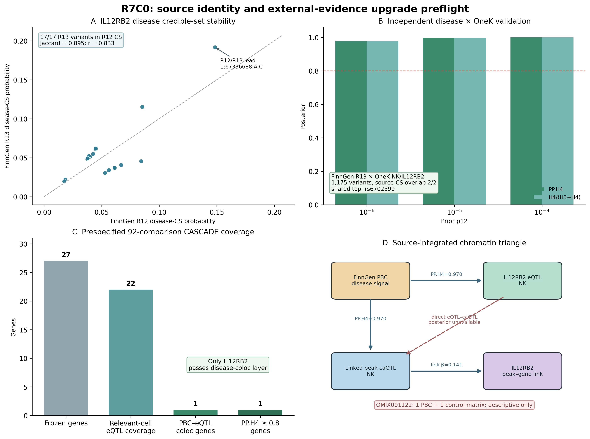
